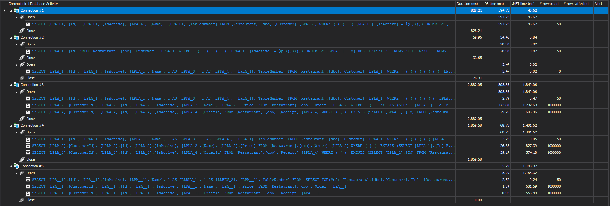

# LLBLGen.Pagination
## Restaurant DB Schema
Database Engine: Microsoft SQL Server.
Tables:
- Customer
  - Id: primary key.
  - Name: customer name.
  - Table Number: table number the customer is sitting at.
  - IsActive: simple boolean properly for soft deletion.
- Order:
  - Id: primary key.
  - Name: order name.
  - CustomerId: ID of the customer who made the order.
  - IsActive: simple boolean properly for soft deletion.
- Receipt
  - Id: primary key.
  - CustomerId: ID of the customer who made the order.
  - OrderId: ID of the order the customer made.
  - IsActive: simple boolean properly for soft deletion.
  
Notes: all columns are not nullable for simplicity, and seeded with 1 million rows using the migration project.

## How to initialize the DB
- Create a DB query called Restaurant (if you change the name, update the connection strings in all projects).
- Run `LLBLGen.Pagination.Migration` with `--up` argument.
- You should have a schema as documented above.
- For LLBLGen project, add `Customer`, `Order`, and `Receipt` tables, reverse-engineer entities, and add one Dervied Model of the type `DTO Class Model` then add a derived element called `CustomerView` and choose the root entity `Customer` and first-level children and first-level subchildren entities too. All code generation tasks target .NET 8 since .NET 10 is not included yet.

## Issue
When using pagination with projection without a WHERE clause or with a non-restrictive one, it leads to a complex query that accesses all rows instead of only applying it to the rows included in the requested page.  

## How to reproduce the issue
Run `LLBLGen.Pagination` project. It has multiple different scenarios, documented below. Make sure you have ORM Profiler running.  

For all scenarios, the basic query is to get rows from the table `Customer` using a WHERE clause that returns a lot of rows for illustration and apply pagination.  

All scenarios have a timeout of 30 seconds to avoid consuming all available RAM in case things go wrong.  

In the build output folder, you can find a `logs` folder with a log file per scenario, and there is a copy attached at the repository root in `SampleLogs` too. The logs include generated queries too.  

You can also find a snapshot from ORM Profiler in the repository root.  

## ORM Profiler results
The following results are referenced in the scenario documentation, specifically the `# rows read` column.


## Scenario 1: Pagination without projection.  
Simply fetches 50 rows (page size is 50).  
Result: fetches exactly 50 rows across all queries as shown in ORM Profiler.  
ORM Profiler Connection: #1.  
Query:
```csharp
var rows = await meta.Customer
  .Where(x => x.IsActive)
  .OrderByDescending(x => x.Id)
  .Skip(5 * 50)
  .Take(50)
  .ToListAsync();
```
Generated SQL query sample:
```sql
SELECT
    [LPA_L1].[Id],
    [LPA_L1].[IsActive],
    [LPA_L1].[Name],
    [LPA_L1].[TableNumber] 
FROM
    [Restaurant].[dbo].[Customer] [LPA_L1] 
WHERE
    (
        (
            (
                (
                    (
                        [LPA_L1].[IsActive] = @p1
                    )
                )
            )
        )
    ) 
ORDER BY
    [LPA_L1].[Id] DESC OFFSET 250 ROWS FETCH NEXT 50 ROWS ONLY

Name	DbType	Value
@p1	Boolean	True
```
Logs: [SampleLogs/Test_1_-_Pagination_without_Projection_20251120_175537355.log](https://github.com/mostafa-abdelbrr-silverkey/LLBLGen.Pagination/blob/main/SampleLogs/Test_1_-_Pagination_without_Projection_20251123_114854927.log)

## Scenario 2: Pagination with projection and filtering.  
Fetches 50 rows using pagination without projection first and selects IDs then it is used as a filter in the pagination with projection query.    
Result: Only 50 rows are accessed in both queries.  
ORM Profiler Connection: #2.  
Query:
```csharp
var query = meta.Customer
    .Where(x => x.IsActive)
    .OrderByDescending(x => x.Id);

var rowsIds = await query
    .Skip(5 * 50)
    .Take(50)
    .Select(x => x.Id)
    .ToListAsync();

var rows = await query
    .Where(x => rowsIds.Contains(x.Id))
    .Skip(5 * 50)
    .Take(50)
    .ProjectToCustomerView()
    .ToListAsync();
```
Generated SQL query sample:
```sql
SELECT
    [LPLA_1].[Id],
    [LPLA_1].[IsActive],
    [LPLA_1].[Name],
    1 AS [LPFA_3],
    1 AS [LPFA_4],
    [LPLA_1].[TableNumber] 
FROM
    [Restaurant].[dbo].[Customer] [LPLA_1] 
WHERE
    (
        (
            (
                (
                    (
                        (
                            (
                                (
                                    (
                                        [LPLA_1].[IsActive] = @p1
                                    )
                                )
                            ) 
                            AND (
                                [LPLA_1].[Id] IN (
                                    @p2, @p3, @p4, @p5, @p6, @p7, @p8, @p9, @p10, @p11, @p12, @p13, @p14, @p15, @p16, @p17, @p18, @p19, @p20, @p21, @p22, @p23, @p24, @p25, @p26, @p27, @p28, @p29, @p30, @p31, @p32, @p33, @p34, @p35, @p36, @p37, @p38, @p39, @p40, @p41, @p42, @p43, @p44, @p45, @p46, @p47, @p48, @p49, @p50, @p51
                                )
                            )
                        )
                    )
                )
            )
        )
    ) 
ORDER BY
    [LPLA_1].[Id] DESC OFFSET 250 ROWS FETCH NEXT 50 ROWS ONLY

Name	DbType	Value
@p1	Boolean	True
@p2	Int32	999750
@p3	Int32	999749
@p4	Int32	999748
@p5	Int32	999747
@p6	Int32	999746
@p7	Int32	999745
@p8	Int32	999744
@p9	Int32	999743
@p10	Int32	999742
@p11	Int32	999741
@p12	Int32	999740
@p13	Int32	999739
@p14	Int32	999738
@p15	Int32	999737
@p16	Int32	999736
@p17	Int32	999735
@p18	Int32	999734
@p19	Int32	999733
@p20	Int32	999732
@p21	Int32	999731
@p22	Int32	999730
@p23	Int32	999729
@p24	Int32	999728
@p25	Int32	999727
@p26	Int32	999726
@p27	Int32	999725
@p28	Int32	999724
@p29	Int32	999723
@p30	Int32	999722
@p31	Int32	999721
@p32	Int32	999720
@p33	Int32	999719
@p34	Int32	999718
@p35	Int32	999717
@p36	Int32	999716
@p37	Int32	999715
@p38	Int32	999714
@p39	Int32	999713
@p40	Int32	999712
@p41	Int32	999711
@p42	Int32	999710
@p43	Int32	999709
@p44	Int32	999708
@p45	Int32	999707
@p46	Int32	999706
@p47	Int32	999705
@p48	Int32	999704
@p49	Int32	999703
@p50	Int32	999702
@p51	Int32	999701
```
Logs: [SampleLogs/Test_2_-_Pagination_with_Projection_and_Filtering_20251123_114855943.log](https://github.com/mostafa-abdelbrr-silverkey/LLBLGen.Pagination/blob/main/SampleLogs/Test_2_-_Pagination_with_Projection_and_Filtering_20251123_114855943.log)

## Scenario 3: Pagination with projection.  
Simply fetches 50 rows using pagination and projection.  
Result: Simplest form of the issue where all table rows are accessed instead of only 50.  
ORM Profiler Connection: #3.  
Query:
```csharp
var rows = await meta.Customer
    .Where(x => x.IsActive)
    .OrderByDescending(x => x.Id)
    .Skip(5 * 50)
    .Take(50)
    .ProjectToCustomerView()
    .ToListAsync();
```

Generated SQL query sample:
```sql
SELECT
    [LPLA_1].[Id],
    [LPLA_1].[IsActive],
    [LPLA_1].[Name],
    1 AS [LPFA_3],
    1 AS [LPFA_4],
    [LPLA_1].[TableNumber] 
FROM
    [Restaurant].[dbo].[Customer] [LPLA_1] 
WHERE
    (
        (
            (
                (
                    (
                        (
                            (
                                (
                                    [LPLA_1].[IsActive] = @p1
                                )
                            )
                        )
                    )
                )
            )
        )
    ) 
ORDER BY
    [LPLA_1].[Id] DESC OFFSET 250 ROWS FETCH NEXT 50 ROWS ONLY

Name	DbType	Value
@p1	Boolean	True
```
Logs: [SampleLogs/Test_3_-_Pagination_with_Projection_20251120_175541105.log](https://github.com/mostafa-abdelbrr-silverkey/LLBLGen.Pagination/blob/main/SampleLogs/Test_3_-_Pagination_with_Projection_20251120_175541105.log)

## Scenario 4: Pagination using `TakePage` with projection
Same as the last scenario.  
Simply fetches 50 rows using pagination and projection, but using `TakePage` instead of `Skip/Take`.  
Result: Same as the last scenario. All table rows are accessed instead of only 50.  
ORM Profiler Connection: #4.  
Query:
```csharp
var rows = await meta.Customer
  .Where(x => x.IsActive)
  .OrderByDescending(x => x.Id)
  .TakePage(5, 50)
  .ProjectToCustomerView()
  .ToListAsync();
```
Generated SQL query sample:
```sql
SELECT
    [LPLA_1].[Id],
    [LPLA_1].[IsActive],
    [LPLA_1].[Name],
    1 AS [LPFA_3],
    1 AS [LPFA_4],
    [LPLA_1].[TableNumber] 
FROM
    [Restaurant].[dbo].[Customer] [LPLA_1] 
WHERE
    (
        (
            (
                (
                    (
                        (
                            (
                                [LPLA_1].[IsActive] = @p1
                            )
                        )
                    )
                )
            )
        )
    ) 
ORDER BY
    [LPLA_1].[Id] DESC OFFSET 200 ROWS FETCH NEXT 50 ROWS ONLY

Name	DbType	Value
@p1	Boolean	True
```
Logs: [SampleLogs/Test_4_-_Pagination_using_TakePage_20251123_114858990.log](https://github.com/mostafa-abdelbrr-silverkey/LLBLGen.Pagination/blob/main/SampleLogs/Test_4_-_Pagination_using_TakePage_20251123_114858990.log)

## Scenario 5: Pagination and projection using QuerySpec and QueryFactory
Simply fetches 50 rows using pagination and projection but this time using QuerySpec and QueryFactory.
Result: Same as the last scenario. All table rows are accessed instead of only 50.  
ORM Profiler Connection: #5.  
Query:
```csharp
var q = qf.Customer
    .Where(CustomerFields.IsActive.Equal(true))
    .OrderBy(CustomerFields.Id.Descending())
    .Page(5, 50)
    .ProjectToCustomerView(qf);
```
Generated SQL query sample:
```sql
SELECT [LPA__1].[Id],
       [LPA__1].[IsActive],
       [LPA__1].[Name],
       1 AS [LLBLV_1],
       1 AS [LLBLV_2],
       [LPA__1].[TableNumber]
FROM   (SELECT TOP(@p2) [Restaurant].[dbo].[Customer].[Id],
                        [Restaurant].[dbo].[Customer].[IsActive],
                        [Restaurant].[dbo].[Customer].[Name],
                        [Restaurant].[dbo].[Customer].[TableNumber]
        FROM   [Restaurant].[dbo].[Customer]
        WHERE  (([Restaurant].[dbo].[Customer].[IsActive] = @p3))
        ORDER  BY [Restaurant].[dbo].[Customer].[Id] DESC) [LPA__1] 

Name	DbType	Value
@p2	Int64	50
@p3	Boolean	True
```
Logs: [SampleLogs/Test_5_-_Pagination_using_QuerySpec_20251123_114900856.log](https://github.com/mostafa-abdelbrr-silverkey/LLBLGen.Pagination/blob/main/SampleLogs/Test_5_-_Pagination_using_QuerySpec_20251123_114900856.log)