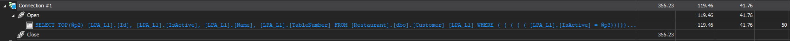
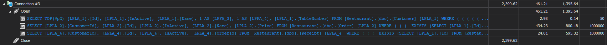
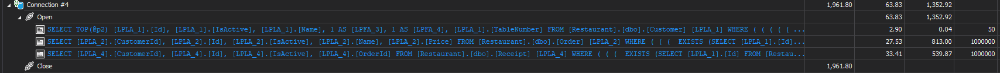
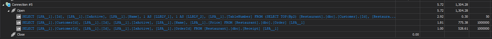

# LLBLGen.Pagination
## Restaurant DB Schema
Database Engine: Microsoft SQL Server.
Tables:
- Customer
  - Id: primary key.
  - Name: customer name.
  - Table Number: table number the customer is sitting at.
  - IsActive: simple boolean properly for soft deletion.
- Order:
  - Id: primary key.
  - Name: order name.
  - CustomerId: ID of the customer who made the order.
  - IsActive: simple boolean properly for soft deletion.
- Receipt
  - Id: primary key.
  - CustomerId: ID of the customer who made the order.
  - OrderId: ID of the order the customer made.
  - IsActive: simple boolean properly for soft deletion.
  
Notes: all columns are not nullable for simplicity, and seeded with 1 million rows using the migration project.

## How to initialize the DB
- Create a DB query called Restaurant (if you change the name, update the connection strings in all projects).
- Run `LLBLGen.Pagination.Migration` with `--up` argument.
- You should have a schema as documented above.
- For LLBLGen project, add `Customer`, `Order`, and `Receipt` tables, reverse-engineer entities, and add one Dervied Model of the type `DTO Class Model` then add a derived element called `CustomerView` and choose the root entity `Customer` and first-level children and first-level subchildren entities too. All code generation tasks target .NET 8 since .NET 10 is not included yet.

## Issue
When using pagination with projection without a WHERE clause or with a non-restrictive one, it leads to a complex query that accesses all rows instead of only applying it to the rows included in the requested page.  

## How to reproduce the issue
Run `LLBLGen.Pagination` project. It has multiple different scenarios, documented below. Make sure you have ORM Profiler running.  

For all scenarios, the basic query is to get rows from the table `Customer` using a WHERE clause that returns a lot of rows for illustration and apply pagination.  

All scenarios have a timeout of 30 seconds to avoid consuming all available RAM in case things go wrong.  

In the build output folder, you can find a `logs` folder with a log file per scenario, and there is a copy attached at the repository root in `SampleLogs` too. The logs include generated queries too.  

You can also find a snapshot from ORM Profiler in the repository root.  

## Scenario 1: Pagination without projection.  
Simply fetches 50 rows (page size is 50).  
Result: fetches exactly 50 rows across all queries as shown in ORM Profiler.  
ORM Profiler Connection: #1.  

Query:
```csharp
var rows = await meta.Customer
                .Where(x => x.IsActive)
                .OrderByDescending(x => x.Id);
                .Skip((pageNumber - 1) * _pageSize)
                .Take(_pageSize)
                .ToListAsync();
```
Generated SQL query sample:
```sql
Query: SELECT TOP(@p2) [LPA_L1].[Id], [LPA_L1].[IsActive], [LPA_L1].[Name], [LPA_L1].[TableNumber] FROM [Restaurant].[dbo].[Customer] [LPA_L1] WHERE ( ( ( ( ( [LPA_L1].[IsActive] = @p3))))) ORDER BY [LPA_L1].[Id] DESC
Parameter: @p2 : Int64. Length: 0. Precision: 0. Scale: 0. Direction: Input. Value: 50.
Parameter: @p3 : Boolean. Length: 0. Precision: 0. Scale: 0. Direction: Input. Value: True.
```
Logs: [SampleLogs/Test_1_-_Pagination_without_Projection_20251120_175537355.log](https://github.com/mostafa-abdelbrr-silverkey/LLBLGen.Pagination/blob/main/SampleLogs/Test_1_-_Pagination_without_Projection_20251120_175537355.log)

## Scenario 2: Pagination with projection and filtering.  
Fetches 50 rows using pagination without projection first and selects IDs then it is used as a filter in the pagination with projection query.    
Result: Only 50 rows are accessed in both queries.  
ORM Profiler Connection: #2.  

Query:
```csharp
var query = meta.Customer
                .Where(x => x.IsActive)
                .OrderByDescending(x => x.Id);

var rowsIds = await query
    .Skip((pageNumber - 1) * _pageSize)
    .Take(_pageSize)
    .Select(x => x.Id)
    .ToListAsync();

var rows = await query
    .Where(x => rowsIds.Contains(x.Id))
    .Skip((pageNumber - 1) * _pageSize)
    .Take(_pageSize)
    .ProjectToCustomerTestView()
    .ToListAsync();
```
Generated SQL query sample:
```sql
Query: SELECT TOP(@p2) [LPLA_1].[Id] FROM [Restaurant].[dbo].[Customer] [LPLA_1] WHERE ( ( ( ( ( ( ( ( [LPLA_1].[IsActive] = @p3)))))))) ORDER BY [LPLA_1].[Id] DESC
Parameter: @p2 : Int64. Length: 0. Precision: 0. Scale: 0. Direction: Input. Value: 50.
Parameter: @p3 : Boolean. Length: 0. Precision: 0. Scale: 0. Direction: Input. Value: True.
```
Logs: [SampleLogs/Test_2_-_Pagination_with_Projection_and_Filtering_20251120_175539039.log](https://github.com/mostafa-abdelbrr-silverkey/LLBLGen.Pagination/blob/main/SampleLogs/Test_2_-_Pagination_with_Projection_and_Filtering_20251120_175539039.log)

## Scenario 3: Pagination with projection.  
Simply fetches 50 rows using pagination and projection.  
Result: Simplest form of the issue where all table rows are accessed instead of only 50.  
ORM Profiler Connection: #3.  

Query:
```csharp
var rows = await meta.Customer
                .Where(x => x.IsActive)
                .OrderByDescending(x => x.Id)
                .Skip((pageNumber - 1) * _pageSize)
                .Take(_pageSize)
                .ProjectToCustomerTestView()
                .ToListAsync();
```

Generated SQL query sample:
```sql
Query: SELECT TOP(@p2) [LPLA_1].[Id], [LPLA_1].[IsActive], [LPLA_1].[Name], 1 AS [LPFA_3], 1 AS [LPFA_4], [LPLA_1].[TableNumber] FROM [Restaurant].[dbo].[Customer] [LPLA_1] WHERE ( ( ( ( ( ( ( ( [LPLA_1].[IsActive] = @p3)))))))) ORDER BY [LPLA_1].[Id] DESC
Parameter: @p2 : Int64. Length: 0. Precision: 0. Scale: 0. Direction: Input. Value: 50.
Parameter: @p3 : Boolean. Length: 0. Precision: 0. Scale: 0. Direction: Input. Value: True.
```
Logs: [SampleLogs/Test_3_-_Pagination_with_Projection_20251120_175541105.log](https://github.com/mostafa-abdelbrr-silverkey/LLBLGen.Pagination/blob/main/SampleLogs/Test_3_-_Pagination_with_Projection_20251120_175541105.log)

## Scenario 4: Pagination using `TakePage` with projection
Same as the last scenario.  
Simply fetches 50 rows using pagination and projection, but using `TakePage` instead of `Skip/Take`.  
Result: Same as the last scenario. All table rows are accessed instead of only 50.  
ORM Profiler Connection: #4.  

Query:
```csharp
var rows = await meta.Customer
                .Where(x => x.IsActive)
                .OrderByDescending(x => x.Id)
                .TakePage(pageNumber, _pageSize)
                .ProjectToCustomerView()
                .ToListAsync();
```
Generated SQL query sample:
```sql
Query: SELECT TOP(@p2) [LPLA_1].[Id], [LPLA_1].[IsActive], [LPLA_1].[Name], 1 AS [LPFA_3], 1 AS [LPFA_4], [LPLA_1].[TableNumber] FROM [Restaurant].[dbo].[Customer] [LPLA_1] WHERE ( ( ( ( ( ( ( [LPLA_1].[IsActive] = @p3))))))) ORDER BY [LPLA_1].[Id] DESC
Parameter: @p2 : Int64. Length: 0. Precision: 0. Scale: 0. Direction: Input. Value: 50.
Parameter: @p3 : Boolean. Length: 0. Precision: 0. Scale: 0. Direction: Input. Value: True.
```
Logs: [SampleLogs/Test_4_-_Pagination_using_TakePage_20251120_175544144.log](https://github.com/mostafa-abdelbrr-silverkey/LLBLGen.Pagination/blob/main/SampleLogs/Test_4_-_Pagination_using_TakePage_20251120_175544144.log)

## Scenario 5: Pagination and projection using QuerySpec and QueryFactory
Simply fetches 50 rows using pagination and projection but this time using QuerySpec and QueryFactory.
Result: Same as the last scenario. All table rows are accessed instead of only 50.  
ORM Profiler Connection: #5.  

Query:
```csharp
var q = qf.Customer
                .Where(CustomerFields.IsActive.Equal(true))
                .OrderBy(CustomerFields.Id.Descending())
                .Page(pageNumber, _pageSize)
                .ProjectToCustomerView(qf);
```
Generated SQL query sample:
```sql
Query: SELECT TOP(@p2) [Restaurant].[dbo].[Customer].[Id], [Restaurant].[dbo].[Customer].[IsActive], [Restaurant].[dbo].[Customer].[Name], [Restaurant].[dbo].[Customer].[TableNumber] FROM [Restaurant].[dbo].[Customer] WHERE ( ( [Restaurant].[dbo].[Customer].[IsActive] = @p3)) ORDER BY [Restaurant].[dbo].[Customer].[Id] DESC
Parameter: @p2 : Int64. Length: 0. Precision: 0. Scale: 0. Direction: Input. Value: 50.
Parameter: @p3 : Boolean. Length: 0. Precision: 0. Scale: 0. Direction: Input. Value: True.
```
Logs: [SampleLogs/Test_5_-_Pagination_using_QuerySpec_20251120_175546415.log](https://github.com/mostafa-abdelbrr-silverkey/LLBLGen.Pagination/blob/main/SampleLogs/Test_5_-_Pagination_using_QuerySpec_20251120_175546415.log)